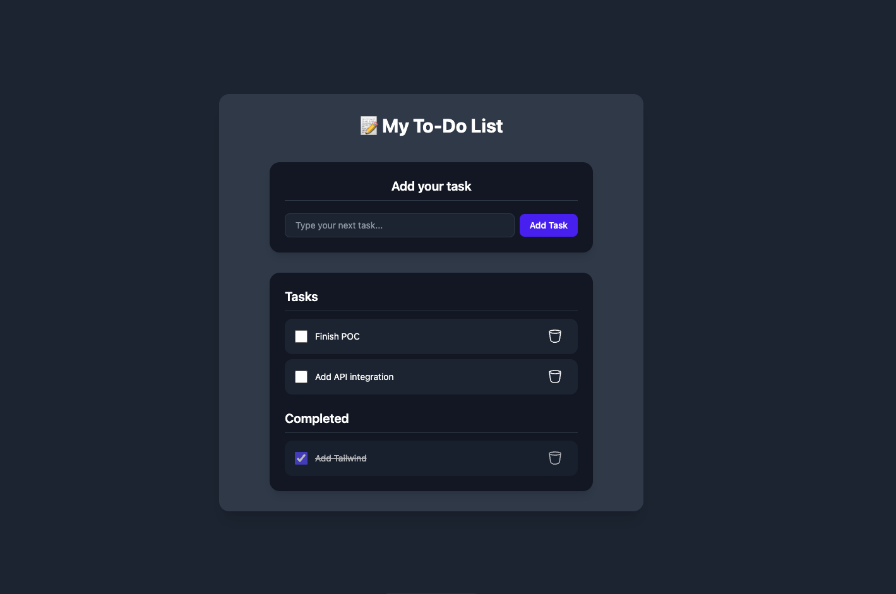

# Astro ToDo POC



## 🚀 Project Structure

Inside of your Astro project, you'll see the following folders and files:

```text
/
├── public/
│   └── favicon.svg
├── src
│   ├── components/react
│   │   └── Container
│   │   └── AddTodo
│   │   └── TodoList
│   │   └── DeleteTodo
│   ├── layouts
│   │   └── Layout.astro
│   └── pages
│       └── index.astro
└── package.json
```
