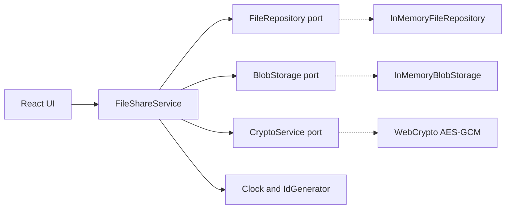

# Vault — encrypted fileshare POC

A deliberately deep browser POC for the complete file lifecycle: **save, download, soft-delete, restore, permanently delete, list and search**, with authenticated encryption and an interface inspired by Google Drive.

## Run it

```bash
pnpm install
pnpm dev
```

Tests and production build:

```bash
pnpm test
pnpm build
```

Everything is intentionally ephemeral. Reloading the page destroys the metadata, encrypted blobs and the non-extractable encryption key.

## Architecture and SOLID



- **Single responsibility:** orchestration, metadata, binary storage and cryptography are separate.
- **Open/closed + dependency inversion:** the application targets ports. IndexedDB, S3 or another cipher can replace the in-memory adapters without changing the use case.
- **Interface segregation:** narrow ports expose only what each collaborator needs.
- **Liskov substitution:** fakes can replace every port in tests with the same observable contract.

`FileShareService` is the application boundary. It writes ciphertext before metadata and compensates by removing the blob if metadata persistence fails. Download decrypts the content, delete only marks metadata with `deletedAt`, restore clears that marker, and permanent deletion removes both metadata and ciphertext.

## Encryption experiment

Web Crypto generates a non-extractable 256-bit AES key once per session. Every save generates a new 96-bit IV, as recommended for GCM. AES-GCM appends a 128-bit authentication tag, so `encryptedSize === originalSize + 16`.

Authenticated encryption provides:

1. **Confidentiality:** in-memory blob storage never receives plaintext.
2. **Integrity/authenticity:** modifying even one ciphertext bit makes restore fail with `OperationError`.
3. **Semantic security for repeated content:** identical files produce different ciphertext because IVs are unique.

The automated tests exercise these claims rather than only calling happy-path methods.

## Important trade-offs

File names, MIME types, sizes and dates remain plaintext because list/search need them. This leaks metadata. A production design could encrypt names and build a keyed blind index for exact-token search, accepting more complexity and weaker substring search.

This is not yet a production fileshare:

- memory is neither durable nor horizontally shared;
- there is no identity, access control, sharing protocol, quota or audit log;
- the session key cannot be recovered after reload;
- large files are buffered completely instead of streamed in chunks;
- no malware scanning or content-disposition hardening is implemented.

## Deep-POC experiments to try next

1. Replace memory adapters with IndexedDB and verify reload recovery.
2. Derive the key from a passphrase with PBKDF2/Argon2id; measure derivation cost and recovery UX.
3. Implement chunked encryption with a unique nonce per chunk and test 1–10 GB files.
4. Compare AES-GCM with libsodium XChaCha20-Poly1305 for nonce ergonomics and browser bundle cost.
5. Add a failing repository test to observe the compensating transaction.
6. Encrypt metadata and compare linear decrypted search with keyed blind indexes.

## Source-reading map

When debugging, step through these boundaries in order:

1. `App.upload` reads browser `File` bytes.
2. `FileShareService.save` coordinates the transaction.
3. `WebCryptoAesGcmService.encrypt` enters the browser's SubtleCrypto implementation.
4. `InMemoryBlobStorage.put` receives only ciphertext.
5. `restore` traverses the same path backwards and GCM verifies the tag.

Useful primary references: [Web Crypto API](https://www.w3.org/TR/WebCryptoAPI/), [NIST SP 800-38D (GCM)](https://csrc.nist.gov/pubs/sp/800/38/d/final), and the [OWASP Cryptographic Storage Cheat Sheet](https://cheatsheetseries.owasp.org/cheatsheets/Cryptographic_Storage_Cheat_Sheet.html).
