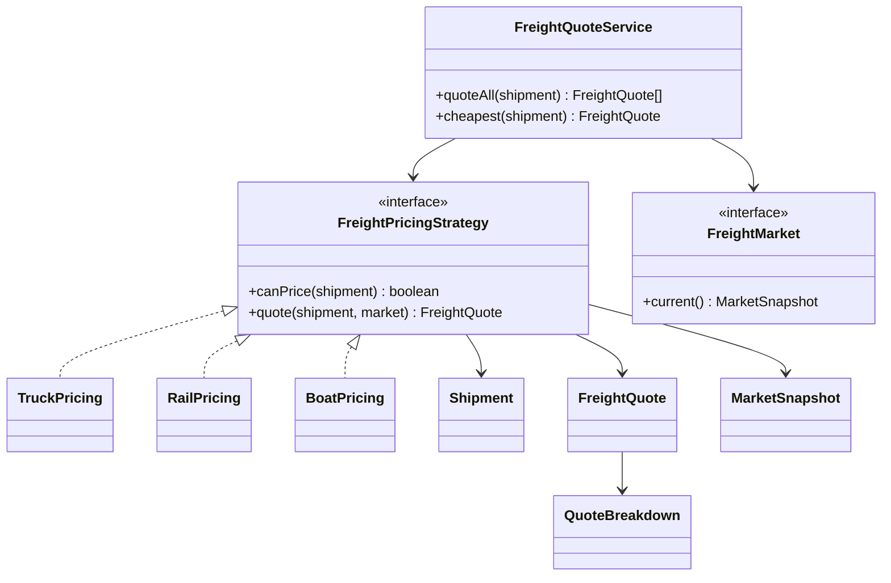

# Freight System - POC

## What this is

This POC models a logistics pricing system. A shipment can be priced by truck, rail, or boat. The price depends on volume, weight, distance, cargo type, service level, and a dynamic market snapshot.

The goal is not a perfect logistics engine. The goal is OOAD practice: make the domain clear, keep rules isolated, and make the system easy to change without editing the calculator every time a new pricing idea appears.

## Run it

```bash
bun run start
bun run test
bun run typecheck
```

## Domain model

### Value Objects

- `Money` stores cents as integers. Freight pricing compounds many small numbers, so floats should not leak through the whole app.
- `Volume`, `Weight`, and `Distance` validate physical measures once and then keep the rest of the code simple.
- `Lane` represents origin and destination with basic invariants.

### Entities

- `Shipment` is the central input. It owns cargo type, service level, route, volume, weight, and distance.
- `FreightQuote` is the output. It is not just a number: it carries mode, carrier, transit time, warnings, and a line-by-line breakdown.
- `QuoteBreakdown` works like a receipt. Each pricing strategy explains the price it produced. The movement cost is adjusted by the market before it enters the final receipt, so a market discount never needs a negative money line.

## Main OOAD ideas

### Strategy Pattern

`FreightPricingStrategy` is the main extension point.

```ts
interface FreightPricingStrategy {
  canPrice(shipment: Shipment): boolean;
  quote(shipment: Shipment, market: MarketSnapshot): FreightQuote;
}
```

Concrete strategies:

- `TruckPricing`
- `RailPricing`
- `BoatPricing`

The calculator does not know the formulas. It asks each strategy if it can price the shipment, then asks for a quote.

### Dependency Inversion

`FreightQuoteService` depends on abstractions:

- `FreightPricingStrategy[]`
- `FreightMarket`

It does not create trucks, rails, boats, or market data internally. That keeps it testable and replaceable.

### Open/Closed Principle

To add air freight, create `AirPricing implements FreightPricingStrategy` and register it in `index.ts`. The quote service stays closed for modification.

To change market behavior, implement `FreightMarket`. Existing pricing strategies keep working.

### Single Responsibility

- Measurements validate measurements.
- Market snapshots provide dynamic multipliers.
- Pricing strategies calculate one transport mode.
- The quote service orchestrates.
- Scenarios print experiments.
- Tests lock in the important rules.

## Dynamic pricing model

`MarketSnapshot` simulates a world where prices keep changing:

- fuel index
- port congestion index
- rail capacity index
- truck demand index
- cargo risk multiplier

Each mode reacts differently:

- Truck reacts to fuel and truck demand.
- Rail reacts to fuel and rail capacity.
- Boat reacts to fuel and port congestion.

That is intentionally simple, but the design gives you a clean place to make it more realistic.

## Scenarios covered

| Scenario                                | What it explores                                             |
| --------------------------------------- | ------------------------------------------------------------ |
| Chicago to Dallas general cargo         | Truck vs rail on a medium route                              |
| Seattle to Miami refrigerated cargo     | Boat and rail on a long route with cold-chain handling       |
| Newark to Atlanta fragile express cargo | Rail rejection and truck express pricing                     |
| Houston to Los Angeles hazardous cargo  | Hazmat fees and risk multiplier                              |
| Calm vs hot market test                 | Same shipment becomes more expensive as dynamic indices rise |

## Why this is a Deep POC

- It models the domain with objects, not loose JSON.
- It keeps pricing policies polymorphic instead of using a big `if/else` calculator.
- It uses value objects to protect invariants near the data.
- It produces explainable results, not magic totals.
- It has failure cases: invalid shipment IDs, impossible lanes, unavailable transport modes.
- It has dynamic pricing without making randomness infect the core logic.
- It has tests that stress behavior, not implementation details.

## Debugging path

Read the code in this order:

1. `src/domain/Shipment.ts`
2. `src/domain/measurements/`
3. `src/pricing/FreightPricingStrategy.ts`
4. `src/pricing/TruckPricing.ts`
5. `src/market/DynamicFreightMarket.ts`
6. `src/calculator/FreightQuoteService.ts`
7. `src/scenarios/Scenarios.ts`

Then run the app and step through `quoteAll`. Watch how each strategy either rejects or prices the same shipment.

## Class diagram



## Possible next improvements/experiments

- Add `AirPricing` and make express cargo prefer it.
- Add contract pricing: some customers have negotiated minimums.
- Add a `CarrierReliabilityPolicy` that increases price or warnings when a carrier is overloaded.
- Add a `QuoteAuditTrail` that records why a strategy rejected a shipment.
- Add property-based tests: hot market should never produce a cheaper quote than calm market for the same mode.
- Add a tiny UI that lets you edit market indices and compare modes live.
