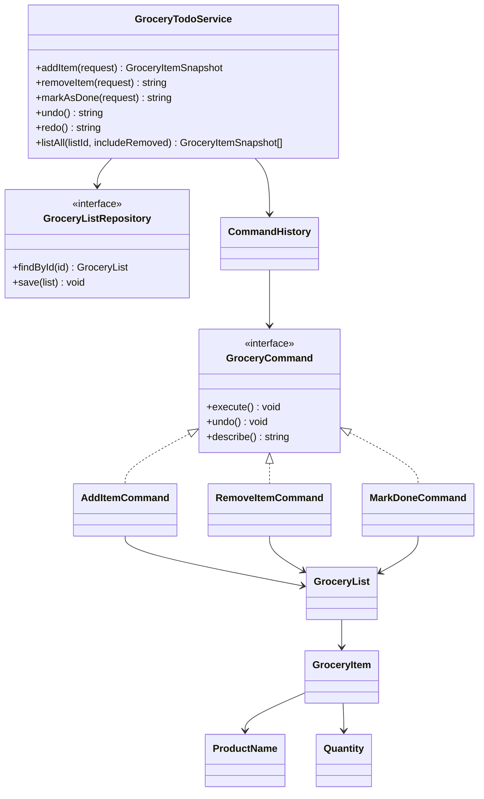

# Grocery Todo List - Deep POC

## What this is

This POC models a grocery todo list system. You can add an item, remove an item, mark an item as done, undo an operation, redo an operation, and list all items.

The goal is not to build a simple array helper. The goal is OOAD practice: keep rules close to domain objects, use value objects for validation, model operations as commands, and make undo/redo behavior explicit and testable.

## Run it

```bash
bun install
bun run dev
bun run build
bun run start
bun run test
bun run typecheck
```

The React/Tailwind UI runs on Vite and uses the same `GroceryTodoService` and command-history domain as the tests and CLI scenario.

## Domain model

### Value Objects

- `GroceryListId` identifies a list.
- `GroceryItemId` identifies an item.
- `ProductName` normalizes whitespace and compares names case-insensitively.
- `Quantity` validates amount and unit.

### Entities

- `GroceryItem` owns item state: pending, done, or removed.
- `GroceryList` owns item collection rules: no duplicate active product in the same category, item lookup, remove, restore, mark done, and list all.

### Application Service

`GroceryTodoService` exposes use-case operations:

- `addItem`
- `removeItem`
- `markAsDone`
- `undo`
- `redo`
- `listAll`

It depends on abstractions/collaborators:

- `GroceryListRepository`
- `GroceryItemIdGenerator`
- `Clock`
- `CommandHistory`

## Main OOAD ideas

### Command Pattern

Each mutation is represented as an object:

- `AddItemCommand`
- `RemoveItemCommand`
- `MarkDoneCommand`

Each command knows how to `execute` and `undo` itself. `CommandHistory` coordinates `do`, `undo`, and `redo`.

This is the core of the POC. Instead of storing random previous states in the service, behavior is encapsulated in command objects.

### Single Responsibility

- `GroceryItem` protects item state transitions.
- `GroceryList` protects collection-level invariants.
- `CommandHistory` only manages undo/redo stacks.
- Commands encapsulate reversible operations.
- `GroceryTodoService` orchestrates use cases.
- Tests validate business behavior.
- Scenarios simulate a learning path.

### Open/Closed Principle

To add a new reversible operation, create a new command:

- `RenameItemCommand`
- `ChangeQuantityCommand`
- `MoveItemToCategoryCommand`
- `ClearDoneItemsCommand`

`CommandHistory` does not need to change as long as the new command implements `GroceryCommand`.

### Dependency Inversion

The service receives repository, clock, id generator, and history from outside. Tests can use fixed collaborators. Production code could replace them with a database-backed repository and real system clock.

## About `do` and `re-do`

This POC interprets `do` and `re-do` as command history operations:

- `do`: execute a command and place it in the done stack.
- `undo`: reverse the last command.
- `redo`: execute the last undone command again.

This makes the list more interesting than a CRUD exercise because operations become reversible domain behavior.

## Scenarios covered

| Scenario | What it explores |
| --- | --- |
| React grocery workbench | UI operations backed by the same OO service |
| Add milk and apples | Value objects, id generation, repository lookup |
| Mark milk as done | Item status transition |
| Remove apples | Soft removal and `listAll` filtering |
| Undo remove | Restore previous item state |
| Undo done | Move item back to pending |
| Redo done | Reapply command from redo stack |
| Duplicate product | Collection-level invariant |
| Empty history | Failure path for undo/redo |

## Debugging path

Read and debug in this order:

1. `src/domain/value-objects/ProductName.ts`
2. `src/domain/GroceryItem.ts`
3. `src/domain/GroceryList.ts`
4. `src/domain/commands/GroceryCommand.ts`
5. `src/domain/commands/CommandHistory.ts`
6. `src/domain/commands/AddItemCommand.ts`
7. `src/domain/commands/RemoveItemCommand.ts`
8. `src/domain/commands/MarkDoneCommand.ts`
9. `src/application/GroceryTodoService.ts`
10. `src/tests/GroceryTodoRules.test.ts`

Useful breakpoints:

- `CommandHistory.do` to see redo stack clearing.
- `CommandHistory.undo` to see commands moving from done to undone.
- `CommandHistory.redo` to see commands moving back.
- `GroceryList.add` to inspect duplicate product rules.
- `GroceryItem.restore` to inspect undo of removed items.

## Class diagram



## Why this is a Deep POC

- It models item state transitions instead of toggling booleans.
- It treats operations as objects, not procedural branches.
- It includes undo/redo as real behavior.
- It tests success and failure paths.
- It documents debugging order and extension points.
- It keeps application orchestration separate from domain rules.

## Possible next experiments

- Add a React UI with filters for pending, done, and removed.
- Add persistence with local storage or SQLite.
- Add item priority and sorting policies.
- Add recurring grocery templates.
- Add command audit trail with timestamps and user id.
- Add property-based tests for undo/redo invariants.
