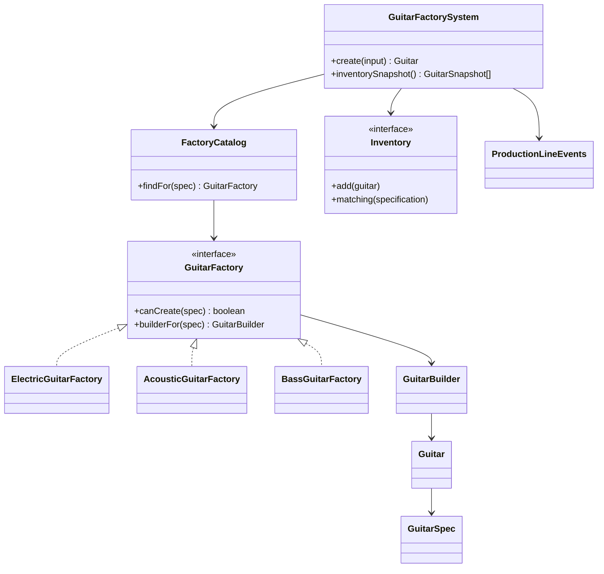

# Guitar Factory - OOAD Challenge

## What this is


This POC models a custom guitar factory. A user configures a guitar with family, model, body shape, wood, pickups, finish, strings, handedness, and onboard OS. The system chooses the right factory, prices the order, builds the guitar through a production line, publishes production events, and stores the finished instrument in inventory.

The UI is a Vite + React + Three.js shop floor. The guitar is procedural: finish, body shape, pickups, string count, tone profile, and production progress update the 3D model as the configuration changes.

## Run it

```bash
pnpm install
pnpm dev
pnpm test
pnpm scenarios
pnpm typecheck
pnpm build
```

## Domain model

### Value Objects

- `Money` stores cents and blocks float leakage.
- `SerialNumber` issues validated factory serials.
- `GuitarSpec` protects compatibility rules between family, body shape, pickups, and string count.

### Entities

- `Guitar` owns serial, spec, price, and build stage.
- `InMemoryInventory` stores finished guitars and queries them with specifications.

### Services and orchestration

- `GuitarFactorySystem` is the application use case.
- `FactoryCatalog` resolves the concrete factory without the use case knowing every factory class.
- `ProductionLineEvents` publishes stage events to observers.

## Patterns used

### Abstract Factory

`ElectricGuitarFactory`, `AcousticGuitarFactory`, and `BassGuitarFactory` create family-specific builders. The application asks the catalog for a factory and stays closed to new guitar families.

### Builder

`GuitarBuilder` expresses the production pipeline: body cut, neck carved, electronics installed, finish, quality check.

### Strategy

- `ComponentPricingStrategy` calculates price by components.
- `LacquerFinishStrategy` maps finish choices to renderable materials.
- `MagneticPickupStrategy` maps pickup choices to tone profiles.

### Specification

Inventory search is composed with `FamilySpecification`, `PickupSpecification`, and `AndSpecification`.

### Observer

`ProductionLineEvents` decouples production from UI and logging. The React app subscribes to the same events as the CLI scenarios.

## Why there are no static factories

This POC intentionally avoids static methods. Static creation helpers are convenient, but they easily become hidden global collaborators: callers reach into a class for behavior instead of receiving an explicit dependency. That makes tests harder to isolate, makes state such as serial generation easy to hide, and weakens dependency inversion.

Instead:

- `SequentialSerialNumberIssuer` is an object injected into factories.
- `defaultElectricSpec` is a module-level fixture factory, not behavior on `GuitarSpec`.
- `dollars`, `cents`, and `zeroMoney` are module functions around the `Money` value object.

The result is slightly more explicit, but easier to replace, test, and reason about.

## SOLID notes

- Single Responsibility: spec validation, pricing, factory creation, eventing, inventory, and rendering live in separate objects.
- Open/Closed: add a new family by adding a factory and registering it in `createGuitarFactorySystem`.
- Liskov Substitution: factories implement the same `GuitarFactory` contract.
- Interface Segregation: pricing, finish, pickups, inventory, and events are small ports.
- Dependency Inversion: `GuitarFactorySystem` depends on `FactoryCatalog`, `Inventory`, and `ProductionLineEvents`, not concrete UI details.

## Experiments

1. Family compatibility
   - Electric guitars reject dreadnought bodies.
   - Bass guitars reject non-bass string counts.

2. Factory normalization
   - Acoustic factory forces piezo pickups and swaps unsupported Studio Link OS to Smart Stage OS.

3. Inventory querying
   - Specifications compose without changing inventory internals.

4. UI and domain separation
   - Three.js reads `GuitarSpec` and strategies, but does not price or build guitars.

## Class diagram


