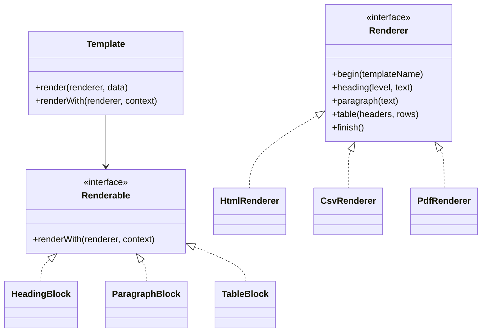

# OOAD POC: Template Render

Goal: build a small object-oriented template renderer where the same template can be rendered as HTML, PDF, or CSV.

This POC intentionally avoids the shallow version of the challenge (`if format === "html"`). The core idea is to model the template as objects and let renderers implement different output strategies through polymorphism.

## Run

```bash
pnpm install
pnpm test
pnpm demo
```

Generated files are written to `output/`:

- `invoice.html`
- `invoice.csv`
- `invoice.pdf`

## Template DSL

```text
# Invoice {{invoice.number}}
Customer: {{customer.name}}

@table items
headers: SKU|Description|Qty|Unit price|Total
columns: sku|description|quantity|unitPrice|total
@end
```

The same parsed template object is sent to three renderers:

- `HtmlRenderer`
- `CsvRenderer`
- `PdfRenderer`

## OOAD Notes

Main objects:

- `Template`: aggregate root for renderable blocks.
- `Renderable`: interface implemented by every block.
- `HeadingBlock`, `ParagraphBlock`, `TableBlock`: template AST nodes.
- `TextExpression`: resolves placeholders like `{{invoice.number}}`.
- `RenderContext`: controlled access to data and nested paths.
- `Renderer`: output port implemented by each format.

The design is a double-dispatch inspired visitor shape: blocks know *what* they are, renderers know *how* each thing should be represented in a specific format.



## Experiments Included

- Success path: one invoice template rendered into three output formats.
- Error path: parser rejects incomplete table definitions.
- Escaping path: HTML escapes unsafe characters, CSV escapes commas and quotes, PDF escapes reserved PDF text characters.
- Deep path: `PdfRenderer` writes a minimal valid PDF structure instead of wrapping HTML.

## Research Directions

Things worth comparing after this POC:

- Visitor pattern vs strategy pattern for rendering.
- Mustache/Handlebars style template engines vs object AST rendering.
- Pull rendering (`renderer.render(template)`) vs push rendering (`template.render(renderer)`).
- Real PDF libraries like PDFKit or pdf-lib vs a minimal PDF writer.
- Streaming renderers for very large CSV/PDF outputs.
