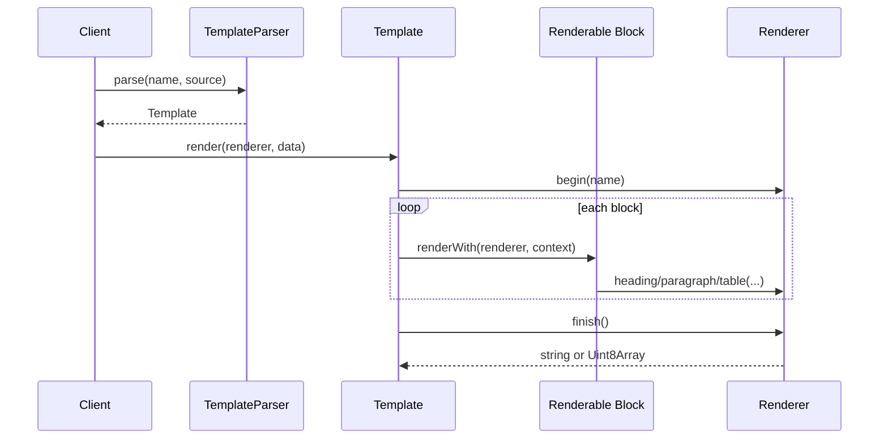

# OOAD Challenge Notes

Theme: render the same template as HTML, PDF, or CSV.

## Why this is OOAD

The domain is not "convert string to output". The domain is a document template made of renderable parts.

Objects in the design:

- `TemplateParser`: translates the DSL into objects.
- `Template`: owns the ordered renderable blocks.
- `Renderable`: contract for anything that can participate in rendering.
- `HeadingBlock`: semantic heading, independent from `<h1>`, CSV rows, or PDF font size.
- `ParagraphBlock`: semantic text block.
- `TableBlock`: semantic tabular data block.
- `TextExpression`: placeholder expression resolver.
- `RenderContext`: protects data access and centralizes path traversal.
- `Renderer`: output port.
- `HtmlRenderer`: escapes HTML and emits a complete document.
- `CsvRenderer`: flattens document semantics into rows.
- `PdfRenderer`: writes a tiny valid PDF object graph.

## Rendering Flow

## Experiments

1. Same template, multiple renderers
   - Expected: no template changes when switching output format.
   - Current proof: tests render the same parsed template with `HtmlRenderer`, `CsvRenderer`, and `PdfRenderer`.

2. Escaping rules
   - HTML must escape `<`, `>`, `&`, quotes.
   - CSV must escape commas and quotes.
   - PDF must escape `\`, `(`, and `)`.

3. Parser failure path
   - A table without both `headers` and `columns` throws early.
   - This prevents a renderer from dealing with malformed template structure.

4. PDF depth experiment
   - The POC writes a minimal PDF directly: catalog, pages, page, font, content stream, xref, trailer.
   - This is intentionally educational and not a replacement for `pdf-lib` or PDFKit.

## Patterns To Compare Later

- Visitor pattern: more explicit operations per block, useful when many node types exist.
- Strategy pattern: renderer is already a strategy for output format.
- Composite pattern: `Template` is a composite of `Renderable` blocks.
- Interpreter pattern: `TextExpression` is a tiny interpreter for placeholders.

## Next Harder Iterations

- Add conditional blocks: `@if customer.vip`.
- Add loops that render nested block bodies, not only tables.
- Add streaming CSV output for large arrays.
- Add pagination to `PdfRenderer`.
- Add snapshot tests for generated HTML/CSV.
- Compare this custom DSL with Mustache or Handlebars internals.
