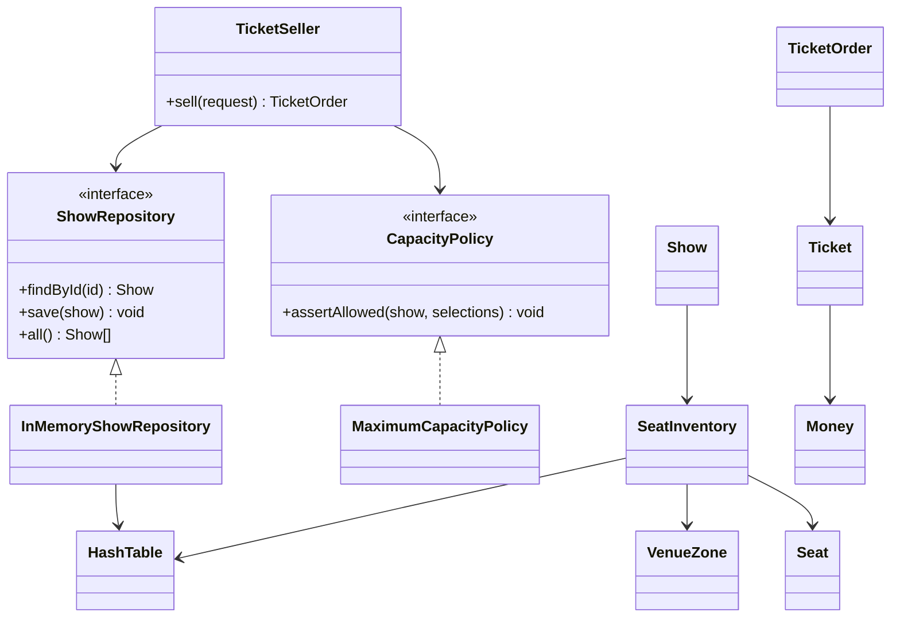

# Ticket System - Deep POC

## What this is

This POC models a ticket-selling system for different shows. A customer can buy a chosen number of tickets for a specific show, choose the venue zone, choose exact seat numbers, and the system must respect the maximum capacity of each zone.

The goal is not to build a production marketplace. The goal is OOAD practice: model the domain with objects, isolate policies, use dependency inversion, and make the rules executable through scenarios and tests.

## Run it

```bash
bun install
bun run dev
bun run build
bun run start
bun run test
bun run typecheck
```

The React/Tailwind UI runs on Vite. It uses the same OO domain and `TicketSeller` application service as the CLI scenarios and tests.

## Domain model

### Value Objects

- `ShowId` validates show identity and avoids passing random strings through the domain.
- `ZoneName` represents named venue zones such as VIP, FLOOR, and BALCONY.
- `SeatNumber` validates seat labels like A1, B12, or C120.
- `Money` stores integer cents to avoid leaking floating-point math into pricing.

### Entities

- `Show` owns a date, a title, and its `SeatInventory`.
- `VenueZone` defines capacity and price for a zone.
- `Seat` knows its zone, number, and sale status.
- `Ticket` represents the result of selling one seat for one show.
- `TicketOrder` groups tickets sold to one customer through one sale channel.

### Collection experiment

`HashTable<K, V>` is a custom hash table with separate chaining and resizing. It is used by:

- `SeatInventory` to locate seats by `zone::seat`.
- `SeatInventory` to locate zones by name.
- `InMemoryShowRepository` to locate shows by id.

The point is not to beat JavaScript `Map`. The point is to practice data-structure thinking and make indexing behavior visible during debugging.

## Main OOAD and SOLID ideas

### Single Responsibility

- Value objects validate primitive data.
- `SeatInventory` manages zone and seat availability.
- `MaximumCapacityPolicy` checks requested seats against remaining capacity.
- `TicketSeller` orchestrates a use case.
- `InMemoryShowRepository` stores shows.
- Scenarios simulate the POC.
- Tests stress success and failure rules.

### Open/Closed Principle

To add a new rule, create another `CapacityPolicy` implementation and inject it into `TicketSeller`.

Examples:

- `PerCustomerTicketLimitPolicy`
- `PresaleWindowPolicy`
- `AccessibleSeatProtectionPolicy`
- `DynamicZoneCapacityPolicy`

The selling use case should not need a new `if` every time the business changes.

### Dependency Inversion

`TicketSeller` depends on abstractions:

- `ShowRepository`
- `CapacityPolicy`
- `OrderIdGenerator`
- `Clock`

This makes the use case deterministic in tests and replaceable in experiments.

### No static methods

This POC intentionally avoids static factory methods. Objects are created through constructors and collaborator objects. That keeps construction explicit and forces dependency injection instead of hidden global helpers.

## Scenarios covered

| Scenario | What it explores |
| --- | --- |
| React ticket workbench | Selling tickets through the same application service used by tests |
| VIP sale for a rock festival | Exact seat selection and zone pricing |
| Mixed-zone jazz order | One order with seats from different zones |
| Capacity snapshots | Remaining seats per zone after sales |
| Already sold seat | Preventing double-selling |
| Duplicated selection | Failing fast before mutating inventory |
| Unknown show | Repository lookup failure |
| Hash collisions | HashTable separate chaining |
| HashTable resizing | Load factor behavior under many inserts |

## Debugging path

Read and debug in this order:

1. `src/domain/value-objects/SeatNumber.ts`
2. `src/domain/collections/HashTable.ts`
3. `src/domain/SeatInventory.ts`
4. `src/domain/Show.ts`
5. `src/domain/policies/MaximumCapacityPolicy.ts`
6. `src/application/TicketSeller.ts`
7. `src/tests/TicketRules.test.ts`
8. `src/scenarios/TicketScenarios.ts`

Useful breakpoints:

- `HashTable.set` to watch bucket collisions and resize.
- `SeatInventory.assertCanSell` to watch validation before mutation.
- `Show.sell` to see quote-before-mutation.
- `TicketSeller.sell` to see application orchestration.

## Class diagram



## Why this is a Deep POC

- It has actual domain objects instead of loose request JSON.
- It has failure scenarios, not only happy-path method calls.
- It uses policies and repository abstractions to practice SOLID.
- It includes a custom data structure and tests collisions/resizing.
- It documents a debugging path and class relationships.
- It makes mutation intentional: validation happens before seats are sold.

## Possible next experiments

- Add reservations with expiration and then convert reservations into sales.
- Add event sourcing with `SeatSold` and `OrderPlaced` domain events.
- Add concurrent selling simulation to discover race conditions.
- Add a UI seat map and use the same domain underneath.
- Add a waitlist policy when a zone sells out.
- Compare custom `HashTable` versus JavaScript `Map` in a benchmark.
